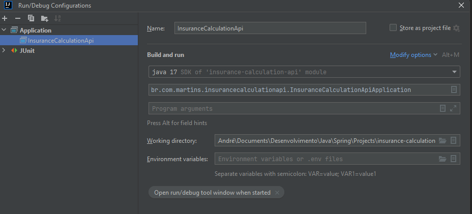
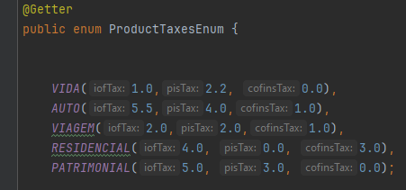
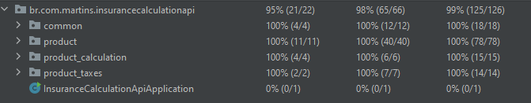

# insurance-calculation-api

### Para executar o projeto:
1. Realizar o download e instalação do OpenJDK 17
2. Abrir o projeto em sua IDE de preferência, aqui foi usado o IntelliJ como exemplo
3. Após o término do download das dependências configurar a classe de execução conforme imagem abaixo:

4. Agora é executar pelo botão Run, ou Shift+F10
5. Para auxiliar nas chamadas api importar a collection(Insurance Calculation Api.postman_collection.json) no postman 

## Sobre a solução:

* O padrão utilizado foi a Arquitetura Hexagonal, o diagrama abaixo demonstra as camadas e a relação entre elas:

* Para realizar o cálculo foi utilizado o Design Pattern Strategy permitindo que cada produto
tenha a possibilidade de especializar sua fórmula de cálculo trazendo flexibilidade e extensibilidade para solução. Diagrama abaixo:

* Em relação aos impostos dos produtos, para simplificar foi utilizado uma enumeração(ProductTaxesEnum) onde temos
as taxas dos impostos por categoria de produto. Se o imposto não deve ser cobrado deve-se informar 0.0, caso essa tabela fosse persistida
em banco de dados os campos não permitiriam null.

* Relacionado a camada Rest, foi configurado o básico para atender os requisitos, foram tratadas mensagens
amigáveis para o usuário e retorno correto de status HTTP. Se fôssemos disponibilizar em algum ambiente é necessário implementação de segurança, docs(swagger).

* Relacionado a camada de persistência, para simplificar, foi realizado o básico para persitir os produtos, o banco HSQLDB está embarcado e se reiniciar a aplicação
irá perder os dados. Se fôssemos disponibilizar em algum ambiente seria necessário incluir a dependência do banco de dados escolhido, configurar as
propriedades como dialeto do hibernate, pool, string de conexão e também gerenciar a criação das tabelas utilizando Flyway por exemplo.

* Em relação aos testes, foi utilizado Mockito com JUnit para os testes unitários, e, para
testes integrados/componentes/end-to-end foi utilizado SpringBootTest com JUnit obtendo total cobertura: 

* Sobre a observabilidade(métricas, traces e logs), esse tema é específico por produto(Datadog, Dynatrace, Grafana...), suas configurações de ambiente, bibliotecas, agents são diferentes, o Datadog por exemplo é necessário rodar a aplicação com um agent(APM) embarcado no processo,
incluir a dependência para a lib a qual disponibiliza métodos para trace e envio de métricas, os logs também precisam
ser configurados para serem vinculados aos traces e seu formato deve ser o que o produto recomenda, no caso do Datadog,
formato em Json, visto isso, nessa solução foi colocado apenas o registro de erros em console usando o logging(SLFJ). A classe
que intercepta as exceções(oriundas das chamadas da api) e faz o registro em log é a RestControllerAdvice.
