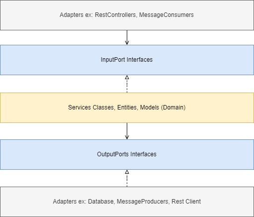
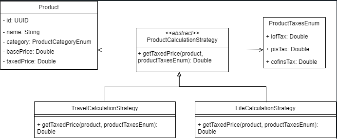

# insurance-calculation-api

### Para executar o projeto:
* Instalar o OpenJDK 17
* IDE de preferência, sugestão IntelliJ
* Abrir o projeto, o IntelliJ irá baixar as dependências, após isso configurar a classe de execução:

* Após isso basta executar pelo botão Run, ou Shift+F10

## Sobre a solução:

* O padrão utilizado foi a Arquitetura Hexagonal, o diagrama abaixo demonstra as camadas e a relação entre elas:

* Para realizar o cálculo foi utilizado o Design Pattner Strategy permitindo que cada produto
tenha a possibilidade de especializar sua fórmula de cálculo trazendo flexibilidade e extensibilidade para solução. Diagrama abaixo:

* Sobre as taxas de impostos dos produtos, para simplicar foi utilizado uma enumeração(ProductTaxesEnum) onde temos
as taxas para cada categoria de produto. A premissa aqui é que sempre deva existir uma taxa mesmo que seja
zero e nesse caso não será incluída no valor final. Se essa tabela estivesse persistida no banco de dados
os campos não permitiriam null.

* Relacionado a camada Rest, foi configurado o básico para atender os requisitos, foram tratadas mensanges
amigáveis para o usuário e retorno correto de status HTTP. Se fossemos disponibilizar em algum ambiente é necessário implementação de segurança, docs(swagger).

* Relacionado a camada de persistência, por simplicidade, foi realizado o básico para persitir os produtos, o banco HSQLDB está embarcado e se reiniciar a aplicação
irá perder os dados. Se fossemos disponibilizar em algum ambiente é necessário incluir a dependência do banco de dados escolhido, configurar as
propriedades como dialeto do hibernate, pool, string de conexão.

* Em relação aos testes, foi utilizado Mockito com JUnit para os testes das unidades menores, e, para
testar adapters, banco, rest foi utilizado SpringBootTest com JUnit obtendo total cobertura: 
